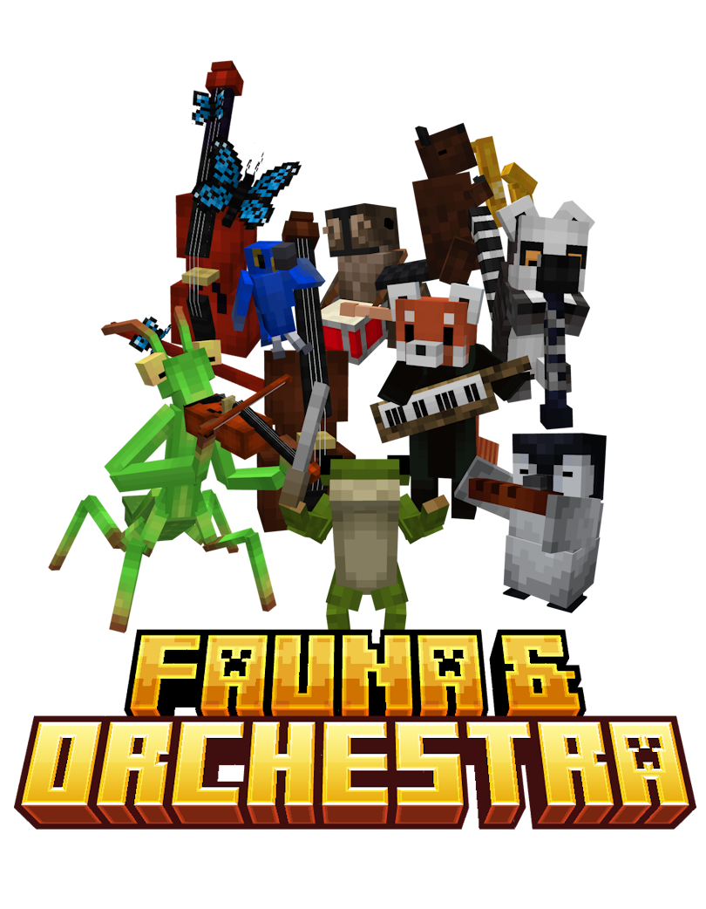

# Fauna & Orchestra

**Fauna & Orchestra** is a magical exploration mod that harmonizes the natural world with the power of music. Embark on a journey to assemble your own orchestra, master musical sorcery, and protect the world from the looming threat of the **Great Composer**.

---

## Features

### ♪ The Great Composer Saga — A narrative-driven mod
Embark on a story-driven journey to stop the **Great Composer** from overwriting the world's natural melody. Gather allies, master *melomancy*, and prepare for an epic battle. The saga has just begun and will continue in future updates!

### ♪ Assemble Your Orchestra
Discover **unique animals** across the world and equip them with specialized instruments. From the leading *quirky frog conductor* to the *mantis violinist*, each creature brings its own sound! Customize your ensemble with unique costumes and headwear.

### ♪ Melomancy & Natural Recipes
Use the Patchouli-powered **Symphonia** Guidebook to master *Melomancy* and *Natural Recipes*, a new organic crafting system. These new recipes, like the Boogie Bomb or the Biosonic Dirk, are fully supported by JEI.

### ♪ A World Alive with Melody
Explore new structures like *The Inn* to hear the **Jazzy Dammys** play, or uncover the secrets of the charismatic wandering travelers **Faust & Orion**. Need a break? Hire wandering Koala Workers to automate your farming, sewing, and melomancing chores.

---

## 🛠 Installation

### Requirements
* **Minecraft:** 1.21.1 or 1.20.1
* **Mod Loader:** [NeoForge](https://neoforged.net/) or [Forge](https://files.minecraftforge.net/net/minecraftforge/forge/), depending on the version
* **Required Dependencies:**
  * [GeckoLib](https://www.curseforge.com/minecraft/mc-mods/geckolib)
  * [Patchouli](https://www.curseforge.com/minecraft/mc-mods/patchouli)

### Steps
1. Download the latest `.jar` from the [Releases](https://github.com/migueel26/Fauna-And-Orchestra/releases) page.
2. Ensure you have NeoForge installed for version 1.21.1 or Forge for 1.20.1.
3. Drop the mod file and its dependencies into your `.minecraft/mods` folder.
4. Launch the game and start your game!

---

## Getting Started
Once in-game, you will be met with a *mysterious character* which will warn you about the dangers of the musical world, and give you the **Symphonia** guidebook. It has everything you need, including quests and character descriptions!

---

## 🏗 Development
This mod is currently in active development on the `develop` branch.

### Building from Source
If you wish to contribute or test the latest features:
1. Clone the repository: `git clone -b develop https://github.com/migueel26/Fauna-And-Orchestra.git`
2. Run `./gradlew genIntellijRuns`.
3. Build the mod using `./gradlew build`.

---

## Credits & License
* **Lead Developer:** [migueel26](https://github.com/migueel26) *(alias Owlest, Sowl, etc.)*
* **License:** [GNU Lesser General Public License v3.0](https://www.gnu.org/licenses/lgpl-3.0.en.html)
* **Special Thanks:** To the NeoForge, MuseScore and Pixabay community. Also to the amazing creators of Geckolib and Patchouli!

---

## Issues and Suggestions
Found a bug? Have a suggestion for a new animal? Open an [Issue](https://github.com/migueel26/Fauna-And-Orchestra/issues) or a Pull Request! You can also join our [Discord Server](https://discord.gg/sPyJffBgnU) for sneak peeks and announcements!